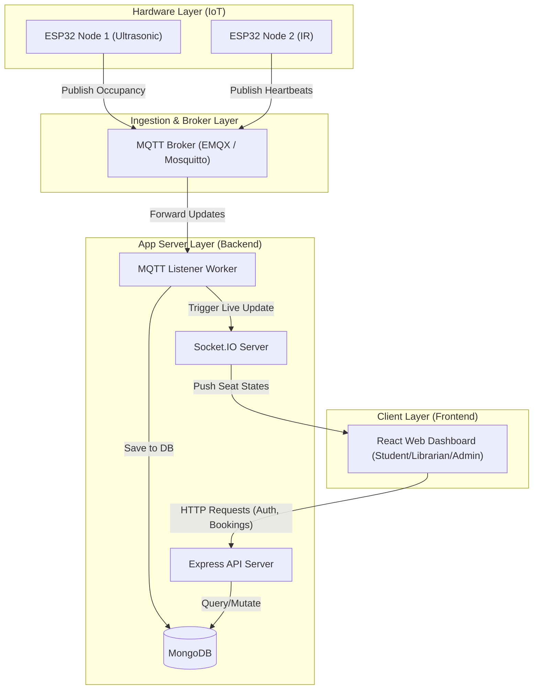

# High-Level Design (HLD)
## SmartLibrary AI - IoT Based Smart Library Seat Management System

### 1. Architectural Style
SmartLibrary AI adopts a **Three-Tier Event-Driven Architecture** to handle real-time data ingestion and display, layered alongside a standard **RESTful Service Oriented Architecture** for request-response flows (like bookings, auth, and analytics).

### 2. High-Level System Architecture
The system consists of the following macro-components:
1.  **Hardware Edge Layer (IoT):** ESP32 nodes checking seat presence.
2.  **Message Queue/Broker Layer:** MQTT Broker handling publish/subscribe message patterns.
3.  **Core Application Engine (Backend):** 
    *   *MQTT Listener:* Worker service subscribing to sensor updates.
    *   *Web Server (REST APIs):* Express handlers for User Auth, Booking, and Devices.
    *   *WebSocket Server (Socket.IO):* Push service dispatching live updates to clients.
    *   *Database Engine:* MongoDB storing structured collections.
4.  **Client Application Layer (Frontend):** React Single Page Application (SPA).

### 3. Core Subsystems & Flows

#### 3.1 Live Status Update Flow
1.  **Trigger:** ESP32 sensor state changes from `0` to `1`.
2.  **Publish:** ESP32 publishes a JSON message to `library/floor1/roomA/seat4/status` payload `{ "occupied": true, "timestamp": 1782345600 }`.
3.  **Consume:** The MQTT listener receives the event, verifies the target seat exists, and writes the state to MongoDB.
4.  **Broadcast:** The MQTT listener sends the message to the Socket.IO broadcast queue.
5.  **Render:** Connected clients receive the `seatStatusChanged` event and update the specific seat node color to Red on the screen dynamically.

#### 3.2 Reservation Lifecycle Flow
1.  **Request:** Student clicks "Book Seat 4" and sends a POST request to `/api/bookings` with timeslot information.
2.  **Verify:** The API server checks if:
    *   The seat is currently Vacant.
    *   The student has not exceeded their daily limit.
    *   There are no double bookings in the selected slot.
3.  **Execute:** If valid, the database creates a `Booking` record, marks the seat status as `Reserved`, and updates the map for other users via WebSockets.
4.  **Verify Physical Presence:** The 15-minute countdown starts. If the sensor publishes `occupied: true` for that seat within 15 minutes, the booking changes to `Active`. Otherwise, a background scheduler releases the seat and flags the student.
