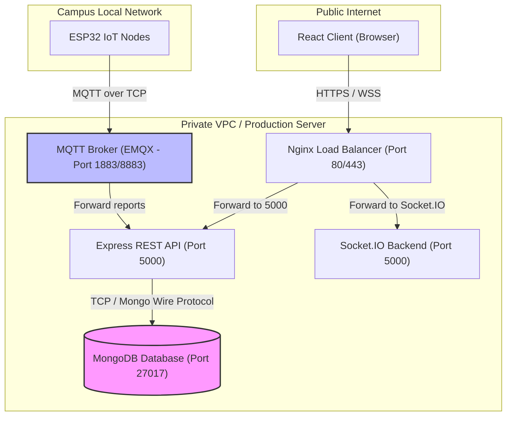

# System Architecture Document (SAD)
## SmartLibrary AI - IoT Based Smart Library Seat Management System

### 1. Architectural Patterns
SmartLibrary AI leverages a layered and modular architecture. We use **Clean Architecture** patterns in the backend, dividing modules into controllers, routing handlers, business service layers, and data access objects (Mongoose models).

```
┌────────────────────────────────────────────────────────┐
│                   React Frontend                       │
└───────────────────────────┬────────────────────────────┘
                            │ (HTTPS REST & Socket.IO)
                            ▼
┌────────────────────────────────────────────────────────┐
│             Nginx Reverse Proxy / Load Balancer        │
└───────────────────────────┬────────────────────────────┘
                            │
                            ▼
┌────────────────────────────────────────────────────────┐
│                    Express Backend                     │
│  ┌──────────────────┐  ┌────────────────────────────┐  │
│  │   REST Server    │  │ WebSocket Server (SocketIO)│  │
│  └────────┬─────────┘  └─────────────┬──────────────┘  │
│           │                          ▲                 │
│           │        ┌─────────────────┘                 │
│           ▼        │ (Trigger updates)                 │
│  ┌─────────────────┴────────────────────────────────┐  │
│  │                 MQTT Listener                    │  │
│  └─────────────────────────▲────────────────────────┘  │
└────────────────────────────┼───────────────────────────┘
                             │
                             ▼
┌────────────────────────────────────────────────────────┐
│                      Databases                         │
│  ┌──────────────────────────────────────────────────┐  │
│  │                 MongoDB (Primary)                │  │
│  └──────────────────────────────────────────────────┘  │
└────────────────────────────────────────────────────────┘
```

### 2. Network & Safety Boundaries



*   **Boundary 1 (Internet facing):** Only Nginx is exposed to the public internet (Ports 80/443). Nginx acts as SSL termination point and routes traffic to the Node.js process running inside the Docker network.
*   **Boundary 2 (Local IoT Network):** ESP32 nodes publish to the MQTT broker using WPA2-Enterprise campus Wi-Fi. The MQTT broker is configured to require authentication (username/password credentials unique to each device).
*   **Boundary 3 (Internal Server Network):** The MongoDB instance is entirely isolated from external requests. It accepts connections strictly from the local IP address of the Express backend container.

### 3. Execution Execution Paths
1.  **Read Operations (Interactive Map):** 
    *   Client logs in -> Requests `/api/floors/:id/seats`.
    *   Express service fetches seats, rooms, and devices from MongoDB.
    *   Returns array to client -> Map is rendered.
    *   Client opens a Socket.IO connection subscribing to rooms divided by `floorId`.
2.  **Write Operations (Occupancy Updates):**
    *   Sensor changes status -> Publishes to MQTT.
    *   Listener reads payload, verifies signature.
    *   Updates `Seat` status in MongoDB.
    *   Broadcasts to room `floorId` -> Connected clients' UI updates dynamically.
