# Use Case Diagrams
## SmartLibrary AI - IoT Based Smart Library Seat Management System

### 1. System Actors
*   **Student (End User):** Searches for seats, books reservations, checks in via physical occupancy, and checks booking history.
*   **Librarian (Operator):** Views real-time occupancy map, overrides active reservations (dispute resolution), modifies seat maintenance modes, and tracks device signals.
*   **Admin (System Administrator):** Full system capability, configures library layout grids, registers new IoT nodes, manages accounts, and views security audit logs.
*   **ESP32 Sensor (System Agent):** Publishes occupancy telemetry and periodic heartbeats.

---

### 2. Use Case Diagram

```mermaid
graph TD
    %% Actors
    student["Student Actor"]
    librarian["Librarian Actor"]
    admin["Admin Actor"]
    esp32["ESP32 IoT Sensor"]

    %% Use Cases (Student)
    uc_view_map["View Live Floor Map"]
    uc_book_seat["Reserve a Seat"]
    uc_cancel_booking["Cancel Booking"]
    uc_check_history["View History"]

    %% Use Cases (Librarian)
    uc_override_seat["Manual Override Seating"]
    uc_maintenance["Toggle Seat Maintenance"]
    uc_device_status["Inspect Device Diagnostics"]

    %% Use Cases (Admin)
    uc_manage_layout["Manage Floor Layouts"]
    uc_manage_devices["Register & Bind Devices"]
    uc_audit_logs["Inspect System Audit Logs"]
    uc_user_mgmt["Manage User Accounts"]

    %% Telemetry Use Case
    uc_send_telemetry["Publish Seat Occupancy Telemetry"]
    uc_send_heartbeat["Publish Heartbeat Status"]

    %% Relationships (Student)
    student --> uc_view_map
    student --> uc_book_seat
    student --> uc_cancel_booking
    student --> uc_check_history

    %% Relationships (Librarian)
    librarian --> uc_view_map
    librarian --> uc_override_seat
    librarian --> uc_maintenance
    librarian --> uc_device_status

    %% Relationships (Admin)
    admin --> uc_manage_layout
    admin --> uc_manage_devices
    admin --> uc_audit_logs
    admin --> uc_user_mgmt
    %% Admin inherits Librarian capabilities
    admin --> uc_override_seat

    %% Relationships (ESP32)
    esp32 --> uc_send_telemetry
    esp32 --> uc_send_heartbeat
```

