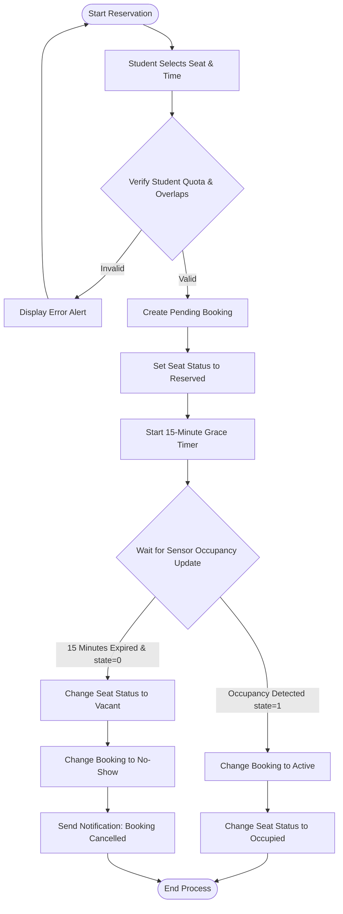
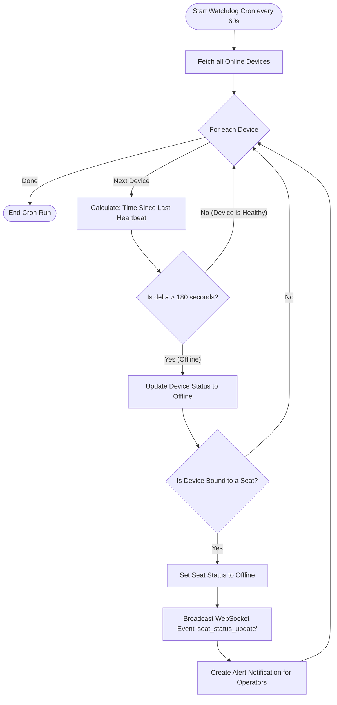

# Activity Diagrams
## SmartLibrary AI - IoT Based Smart Library Seat Management System

### 1. Activity Diagram: Seat Reservation & Grace Period Flow

This flowchart describes the step-by-step lifecycle logic of booking a seat, checking in via IoT sensors, and handling auto-cancellation.

---

### 2. Activity Diagram: Device Watchdog & Heartbeat Lifecycle

This flowchart describes the background polling system that continuously monitors hardware connectivity.

