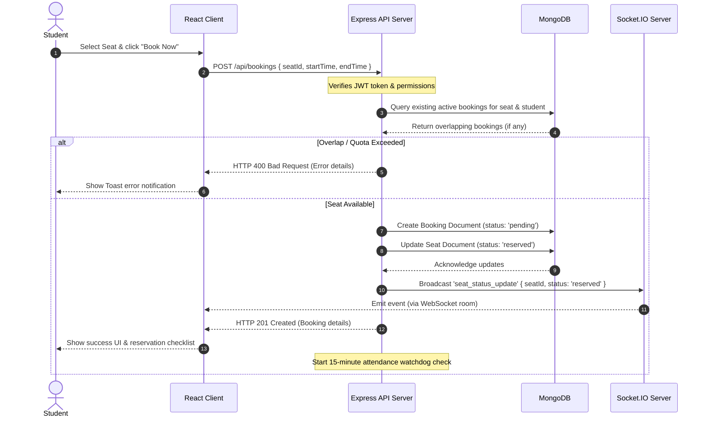
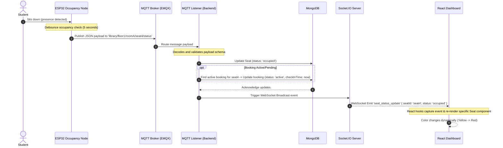

# Sequence Diagrams
## SmartLibrary AI - IoT Based Smart Library Seat Management System

### 1. Sequence Diagram: Seat Reservation Request
This diagram details the flow when a student makes a reservation from the React frontend.

---

### 2. Sequence Diagram: IoT Telemetry Occupancy Update
This diagram details the sequence where the physical sensor detects presence and triggers a UI update.

