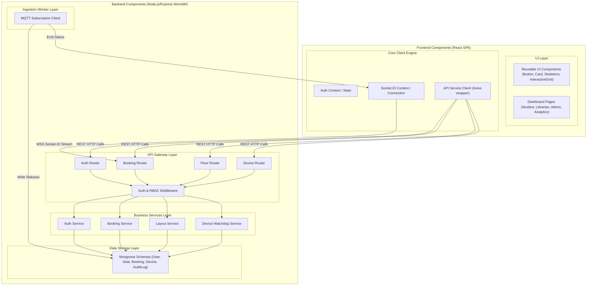

# Component Diagram
## SmartLibrary AI - IoT Based Smart Library Seat Management System

### 1. Component Diagram

The following diagram details the logical components making up the SmartLibrary AI system and how they interface with each other.

---

### 2. Component Descriptions

*   **API Client (Axios Wrapper):** Handles global interception for attaching authorization headers (`Bearer <token>`) and standardizes client-side HTTP error processing.
*   **Auth Middleware:** Inspects JWT tokens from headers, validates signatures, decodes payload info, and checks user authorization scopes (Student, Librarian, Admin) before letting the execution context proceed.
*   **MQTT Subscription Client:** An independent event loop instance that subscribes to the broker topics. It runs validation algorithms, handles reconnection delays, and is decoupled from standard HTTP APIs.
*   **Mongoose Models Layer:** Validates data schemas before passing records to MongoDB. Includes auto-indexing definitions and pre-save hooks (e.g. encrypting user password strings).
