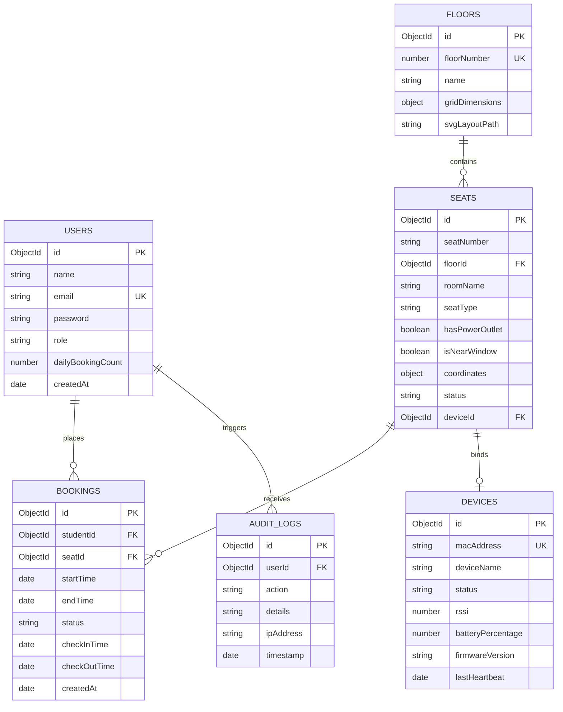

# Entity-Relationship (ER) Diagram
## SmartLibrary AI - IoT Based Smart Library Seat Management System

### 1. Conceptual ER Diagram

This diagram displays the database collections and how they relate via logical references.

---

### 2. Relationship Explanations
*   **Users to Bookings (1 to Many):** A student can make multiple bookings over their time at the institution, but each booking record is linked to a single student.
*   **Seats to Bookings (1 to Many):** A physical seat can be reserved across multiple different time periods, resulting in many booking documents referencing that single seat.
*   **Floors to Seats (1 to Many):** A library floor contains a fixed set of seat nodes. A seat resides on exactly one floor.
*   **Seats to Devices (1 to 0 or 1):** A seat may have at most one physical ESP32 sensor bound to it for checking occupancy status. A device is assigned to at most one seat.
*   **Users to Audit Logs (1 to Many):** Admins and librarians trigger auditing entries whenever they modify layouts, release bookings, or override configurations.
