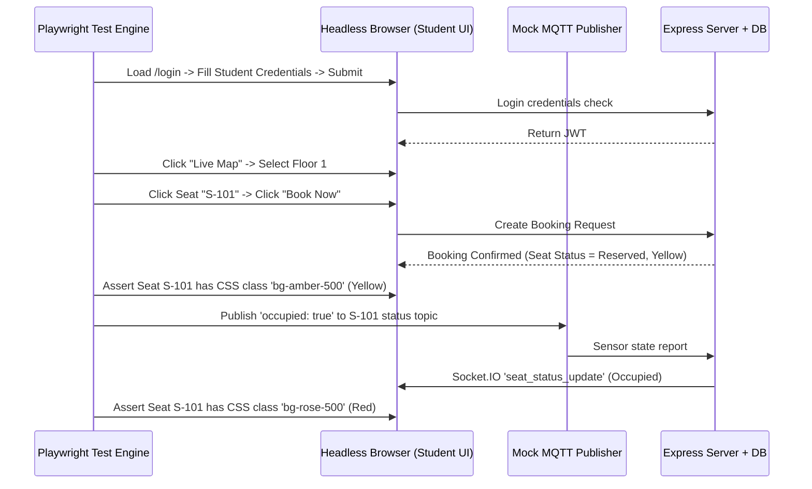

# End-to-End (E2E) Testing Plan
## SmartLibrary AI - IoT Based Smart Library Seat Management System

End-to-End tests verify the application behavior from the user's perspective, running a headless browser using **Playwright** against a compiled frontend and active backend environment.

---

### 1. E2E Test Suite Configurations
*   **Framework:** Playwright (due to its native support for parallel testing, trace viewing, and multi-tab testing).
*   **Test Environment:** Starts the frontend via Vite dev server, runs the backend connecting to the test MongoDB instance, and spawns a local Mosquitto MQTT broker container.

---

### 2. Scenario 1: The Booking & IoT Check-in Happy Path

This test validates the core user flow from initial reservation to automated physical check-in.

---

### 3. Scenario 2: Reservation Grace Period Expiry (Clock Acceleration)
To verify that seats auto-release if the student fails to check in:
1.  Playwright logs in student, books Seat `S-102`.
2.  Assert seat changes to Yellow (`reserved`).
3.  The test runner executes a request to a mock utility API `/api/test/advance-time` or triggers the backend scheduler manually.
4.  Assert that booking state shifts to `no-show`.
5.  Assert that Seat `S-102` changes class back to Green (`vacant`) on the visual map browser interface.
